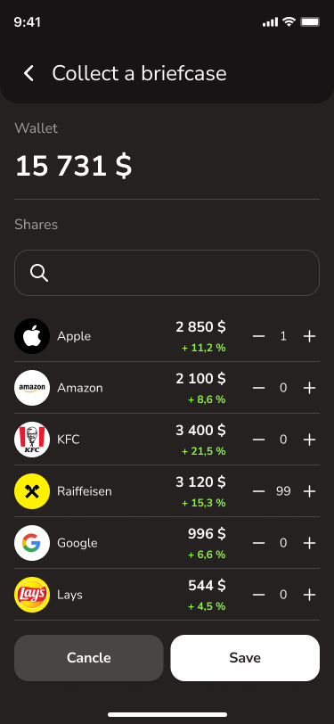
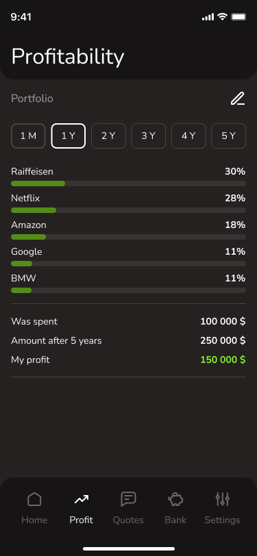
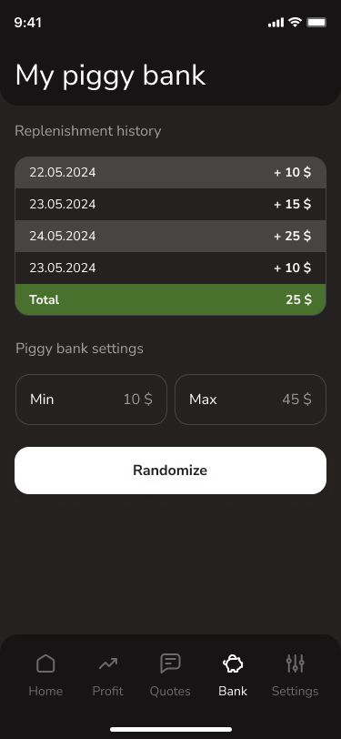

## Приложение для составления портфеля акций и прогнозирования дохода

Онбординг, показывается при первом запуске прилы, и каждый раз пока его полностью не пройдет пользователь
После - показается экран с вводом стартовой суммы

Основная логика - собрать портфель акций и спрогнозировать свой доход. Стартовую сумму можно редактировать

Список акций берется рандомный, штук 20. проценты по ним или взяты в интрнете.  
На этом экране есть поиск по акциям, возможность добавить/убрать акции из портфеля.

После добавления в портфель - акции отображаются на экране home, появляется поиск и возможность редактирования портфеля

На вкладке profit можно оценить свой доход по портфелю за разные промежутки времени.

Список мотивционных цитат, с возможностью отметить избранные - они поднимаются вверх, и есть возможностью поделиться ими стандартными средствами apple.

Экран - копилка, вводится минимальная и максимальная сумма, которую пользователь готов сейчас положить в копилку и приложение рандомно выбирает сколько надо отложить.

По первым трем - редиректить в сафари и открывать ссылку (любую). По последней - вызывать стандартный алерт оценки приложения.

